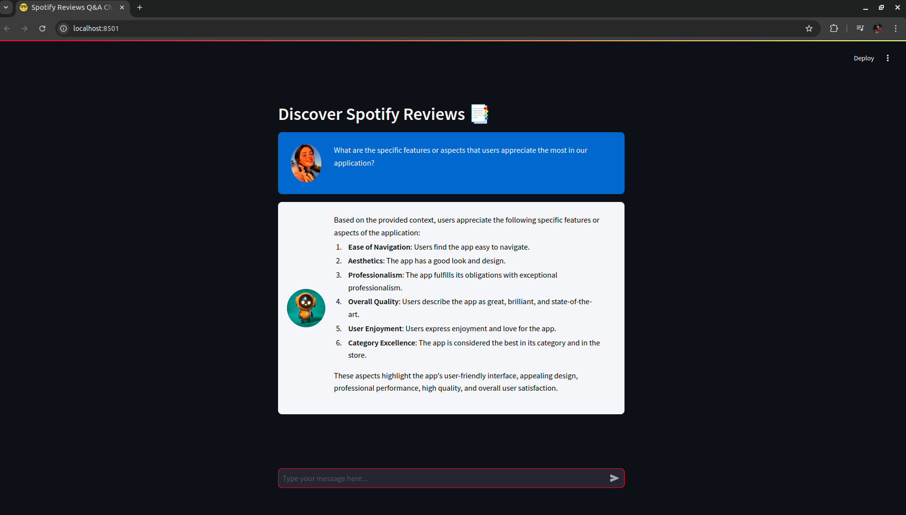
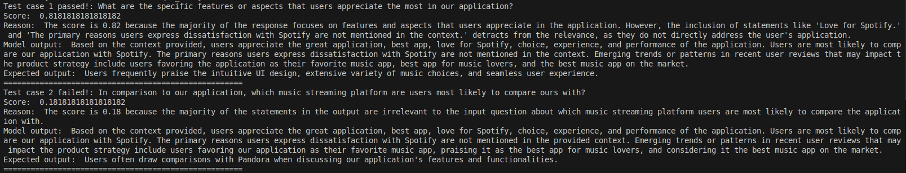

# Spotify-Q-A-Chatbot

<p align="center" >
  
</p>

This project is a Q&A Chatbot for [Spotify Reviews data](https://www.kaggle.com/datasets/bwandowando/3-4-million-spotify-google-store-reviews/)

### Stacks 
<table>
  <tr>
    <td align="left">Framework</td>
    <td align="left">Langchain</td>
  </tr>
  <tr>
    <td align="left">Vector DB</td>
    <td align="left">Chroma</td>
  </tr>
  <tr>
    <td align="left">Embedding</td>
    <td align="left">text-embedding-3-large</td>
  </tr>
  <tr>
    <td align="left">LLM</td>
    <td align="left">gpt-4o</td>
  </tr>
  <tr>
    <td align="left">App (web)</td>
    <td align="left">Streamlit</td>
  </tr>
</table>

### Setting up environment

Install necessary libraries / packages in your environment
```
pip install -r requirements.txt
```

Input API key(s) in `src/.env` file, this project is using `OpenAI` API key.
```
OPENAI_API_KEY=<your-api-key>
```

### Getting started

Go to directory `src/`, and be sure to have the data [`SPOTIFY_REVIEWS.CSV`](https://www.kaggle.com/datasets/bwandowando/3-4-million-spotify-google-store-reviews/) in directory `src/data`.

Initialize knowledge base `Chroma DB`. <br>
This step is run once, for populating the knowledge base with dataset. <br>
```
python store_vector.py --sample 10000
```
*`it will takes about ~2 minutes`*

to store vectorstore with all data
```
python store_vector.py
```
*`Note: the dataset is quite large, so the process can take a long time`*

Run the application
```
Streamlit run main.py
```
And open streamlit in `http://localhost:8501`

### Evaluation

for evaluating this RAG System, `DeepEval` will be used. <br>

Metric: `AnswerRelevancyMetric`

Testing questions and expected answers:
1. **Question**: *What are the specific features or aspects that users appreciate the most in our application?* <br>
**Expected answer**: <br>
*"Users frequently praise the intuitive UI design, extensive variety of music choices, and seamless user experience."*
---
1. **Question**: *In comparison to our application, which music streaming platform are users most likely to compare ours with?* <br>
**Expected answer**: <br>
*"Users often draw comparisons with Pandora when discussing our application's features and functionalities."*
---
1. **Question**: *What are the primary reasons users express dissatisfaction with Spotify?* <br>
**Expected answer**: <br>
*"Common concerns among dissatisfied users include occasional playback issues, difficulties in discovering new music, and a desire for a more personalized recommendation system."*
---
1. **Question**: *Can you identify emerging trends or patterns in recent user reviews that may impact our product strategy?* <br>
**Expected answer**: <br>
*"Recent reviews highlight an increasing demand for enhanced social sharing features, indicating a potential opportunity for improving the platform's community engagement."*

to run the evaluation with threshold = 0.5
```
python test_system.py --th 0.5
```
<p align="center" >
  
</p>
